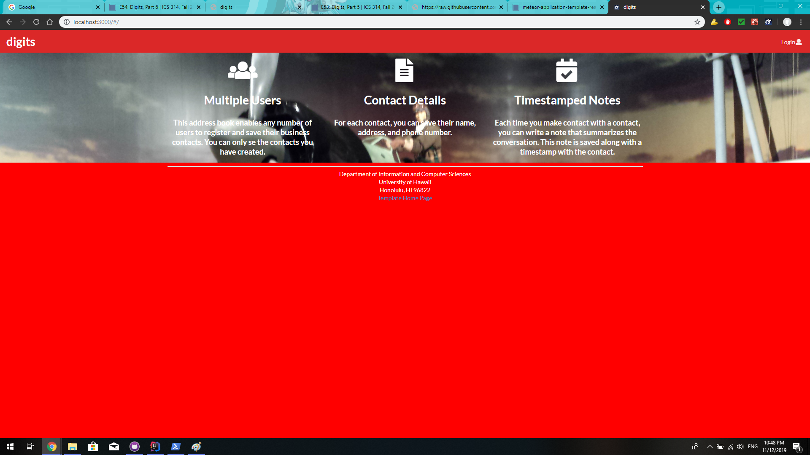
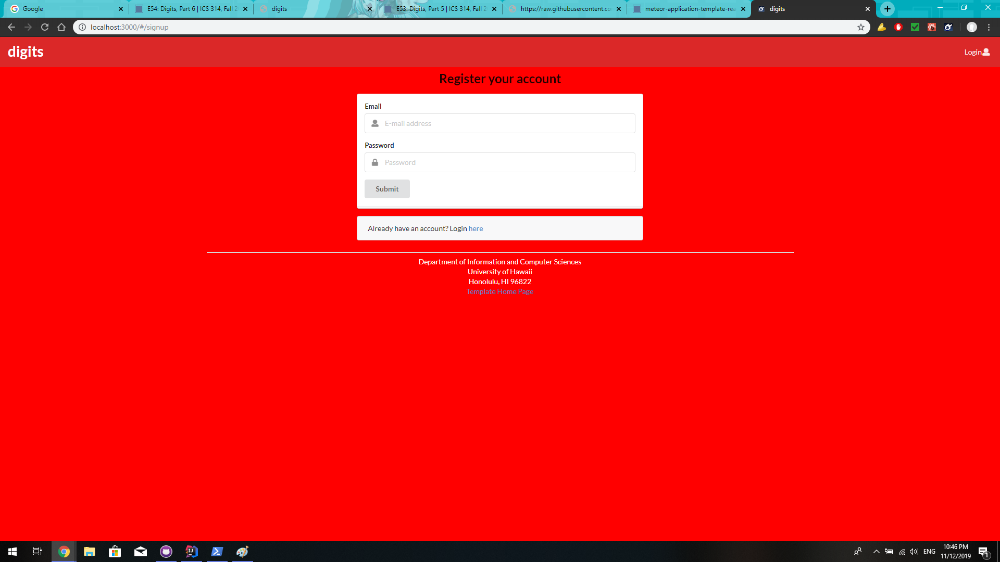
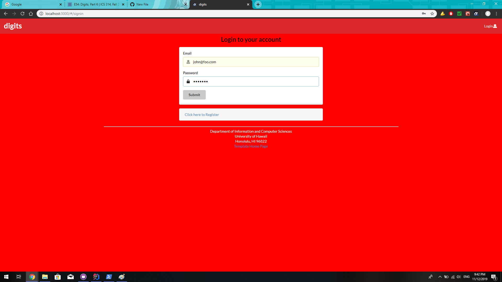
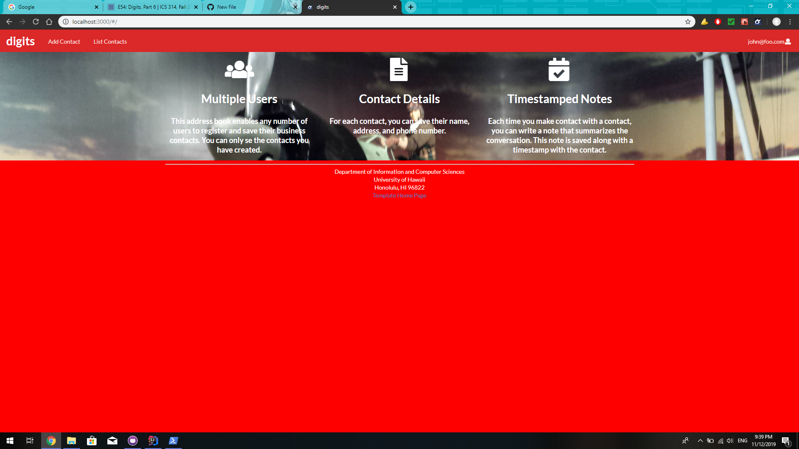
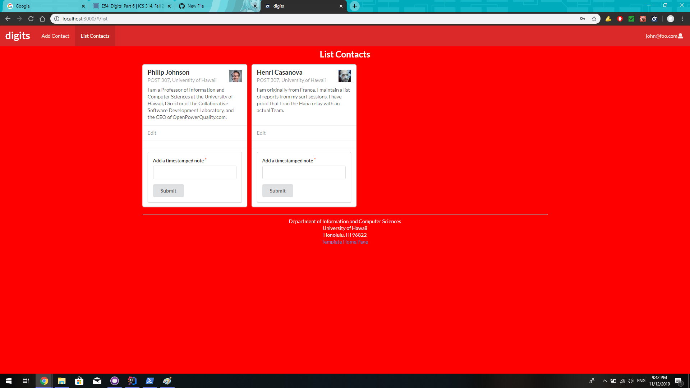
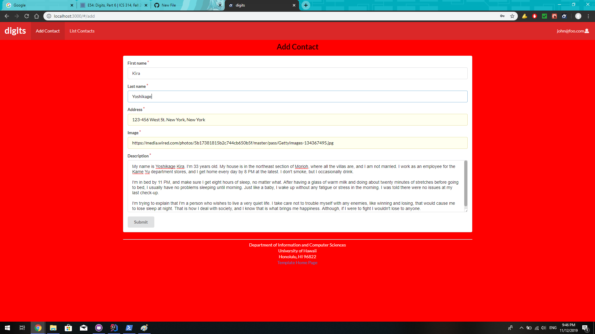
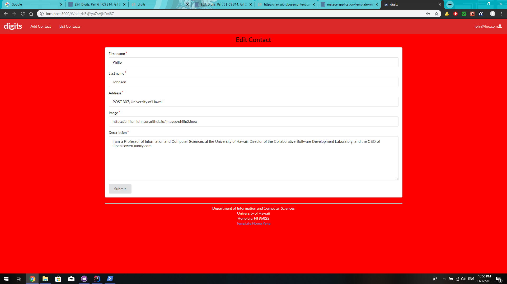

Digits is a program that allows users to:

* Create an account
* Create contacts
* Add timestamed notes to each contact

## How to install
First and foremost, [install Meteor](https://www.meteor.com/install).

Next, download Digits. However, because it is a private repository, please ask permission before doing so.

Using a shell or command line, change to the /app directory and run the following in shell or command line:

````
meteor npm run start
````

to install the necessary components and packages

Then use:
````
meteor npm run start
````
in order to run the program. The following is the output:
````
=> Started proxy.
=> Started MongoDB.
W20191112-21:41:32.039(-10)? (STDERR) Note: you are using a pure-JavaScript implementation of bcrypt.
W20191112-21:41:32.102(-10)? (STDERR) While this implementation will work correctly, it is known to be
W20191112-21:41:32.102(-10)? (STDERR) approximately three times slower than the native implementation.
W20191112-21:41:32.104(-10)? (STDERR) In order to use the native implementation instead, run
W20191112-21:41:32.105(-10)? (STDERR)
W20191112-21:41:32.105(-10)? (STDERR)   meteor npm install --save bcrypt
W20191112-21:41:32.106(-10)? (STDERR)
W20191112-21:41:32.107(-10)? (STDERR) in the root directory of your application.
I20191112-21:41:32.322(-10)? Creating the default user(s)
I20191112-21:41:32.323(-10)?   Creating user admin@foo.com.
I20191112-21:41:32.528(-10)?   Creating user john@foo.com.
I20191112-21:41:32.772(-10)? Creating default data.
I20191112-21:41:32.774(-10)?   Adding: Philip Johnson (john@foo.com)
I20191112-21:41:32.775(-10)?   Adding: Henri Casanova (john@foo.com)
I20191112-21:41:32.776(-10)?   Adding: Kim Binsted (admin@foo.com)
=> Started your app.

=> App running at: http://localhost:3000/
   Type Control-C twice to stop.
````
The warning at the beginning can be safely ignored, so do not worry about it. To access the app, go to:
````
http://localhost:3000
````
## Using Digits
#### Landing page

The first page you come across is the landing page. There's not much here until you log in or sign up.

#### Signing Up

By clicking on the Login button, you get the choice to either log in or sign up. Clicking the Sign Up option will bring you to this page.

#### Log In

Af you have already signed up, you can click on the Log In option to take you to this login page.

#### Profile

After you log in, the page will look like this. Not much has changed except for the Add Contact and List Contacts menu options at the top.

#### Listing Contacts

Clicking on List Contacts will list the contacts like so. If you click on the text box at the bottom of each contact, it will allow you to add a note to the contact.

#### Adding Contacts

Clicking on Add Contact will bring you to this page. Here, you can add contacts, which would immediately be visible from the List Contacts page. Simply add a name, address a profile image, and a description.

#### Edit Contact

Clicking on Edit Contact will allow you to access ths page to edit the contact's information.
